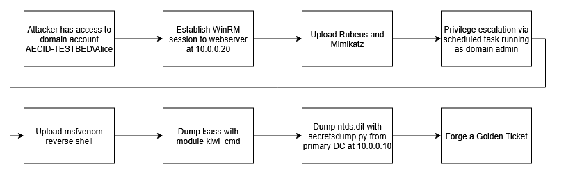

# Winlab

Winlab is an intentionally vulnerable Windows Active Directory lab designed for cybersecurity research.

# Deployment

## Windows Images

- Enable Windows feature Hyper-V
- Install the Windows Assessment and Deployment Kit, see https://learn.microsoft.com/en-us/windows-hardware/get-started/adk-install
- Download Windows Server 2022 Evaluation Edition from https://www.microsoft.com/de-de/evalcenter/download-windows-server-2022
- Download Windows 10 Evaluation Edition from https://www.microsoft.com/en-us/evalcenter/download-windows-10-enterprise
- Mount the Windows Server ISO image
- Create a new virtual switch
    - Open `Hyper-V Manager`
    - Select you machine &rarr; `Virtual Switch Manager`
    - Select `New virtual network switch` and create a switch with type `External` and name `external`

- Generate config file `config.ini` (in elevated shell or image generation will fail):
    ```ps1
    powershell -ep bypass
    git clone https://github.com/cloudbase/windows-imaging-tools
    cd windows-imaging-tools
    Import-Module .\WinImageBuilder.psm1
    Import-Module .\Config.psm1
    Import-Module .\UnattendResources\ini.psm1
    $ConfigFilePath = ".\config.ini"
    New-WindowsImageConfig -ConfigFilePath $ConfigFilePath
    ```

- Update `config.ini` for Windows Server 2022:
    ```txt
    wim_file_path=D:\Sources\install.wim # Windows setup disk
    image_name=Windows Server 2022 SERVERDATACENTER # Check with Get-WimFileImagesInfo D:\Sources\install.wim
    image_path=C:\Users\SCHUST~1\Desktop\OpenStack\Images\windows-server-2022.qcow2
    virtual_disk_format=QCOW2
    enable_administrator_account=True
    enable_custom_wallpaper=False
    compress_qcow2=True
    enable_shutdown_without_logon=True
    enable_ping_requests=True
    administrator_password=P@ssword
    external_switch=external # Name of the external virtual switch created earlier
    cpu_count=4
    ram_size=8589934592 # 8 * 1024 * 1024 * 1024
    disk_size=42949672960 # 40 * 1024 * 1024 * 1024
    virtio_iso_path="C:\Users\SCHUST~1\Desktop\OpenStack\Images\virtio-win.iso"
    install_qemu_ga=True
    ```

- Generate the Windows Server 2022 image:
    ```ps1
    New-WindowsOnlineImage -ConfigFilePath $ConfigFilePath
    ```

- Update `config.ini` for Windows 10 (keep the changes from before, only update the following):
    ```txt
    image_name=Windows 10 Enterprise Evaluation
    image_path=C:\Users\SCHUST~1\Desktop\OpenStack\Images\windows-10.qcow2
    ```

- Generate the Windows 10 image:
    ```ps1
    New-WindowsOnlineImage -ConfigFilePath $ConfigFilePath
    ```

- Copy the images to provisioning VM and upload them to OpenStack:
    ```bash
    openstack image create "windows-server-2022" --file windows-server-2022.qcow2 --disk-format qcow2 --container-format bare --progress
    openstack image create "windows-10" --file windows-10.qcow2 --disk-format qcow2 --container-format bare --progress
    ```

## Kali Image

- Download the Kali Generic Cloud Image for x64 from https://www.kali.org/get-kali/#kali-cloud

- Unzip the image
    ```bash
    tar -xvf kali-linux-2025.2-cloud-genericcloud-amd64.tar.xz
    ```

- Install updates, `cloud-init` `qemu-guest-agent` and enable ssh:
    ```bash
    sudo apt install -y libguestfs-tools
    sudo virt-customize -a disk.raw --update
    sudo virt-customize -a disk.raw --install cloud-init
    sudo virt-customize -a disk.raw --install qemu-guest-agent
    sudo virt-customize -a disk.raw --install kali-linux-default
    sudo virt-customize -a disk.raw --run-command 'systemctl enable ssh.service'
    ```

- Convert the `raw` image to `qcow2`:
    ```bash
    qemu-img convert -f raw -O qcow2 disk.raw kali-2025.2.qcow2
    ```

- Upload the image to OpenStack:
    ```bash
    openstack image create "kali-2025.2" --file kali-2025.2.qcow2 --disk-format qcow2 --container-format bare --progress
    ```

## Terragrunt

- Update the `provider_network_uuid` variable in `terragrunt.hcl`
- Initialise Terragrunt:
    ```bash
    terragrunt init
    ```
- Deploy the environment:
    ```bash
    terragrunt apply
    ```
- Add the following exceptions to Firefox:
    ```txt
    openstack.cyberrange.internal:443
    openstack.cyberrange.internal:5000
    openstack.cyberrange.internal:6080
    ```

## Ansible

- Install `sshpass` for SSH password authentication:
    ```bash
    sudo apt-get install sshpass
    ```

- Check if all hosts are up and running (this might take up to 15min after deploying with Terragrunt, depending on the machine specs):
    ```bash
    bash ansible/test_ssh.sh
    ansible all -m raw -a whoami
    ```

- Pseudo fork:
    ```bash
    # create remote repo with same name and no readme file first
    git clone git@github.com:ait-testbed/atb-ansible-primarydc.git
    cd atb-ansible-primarydc
    git remote remove origin
    git remote add origin git@github.com:FeSchuster/atb-ansible-primarydc.git
    git push -u origin main
    ```

- Clone ansible roles:
    ```bash
    cd ansible/roles
    git clone git@github.com:FeSchuster/atb-ansible-primarydc.git
    git clone git@github.com:FeSchuster/atb-ansible-msclient.git
    git clone git@github.com:ait-testbed/atb-ansible-kafka.git
    git clone git@github.com:FeSchuster/atb-ansible-winwebserver.git
    git clone git@github.com:FeSchuster/atb-ansible-winvulnserver.git
    git clone git@github.com:FeSchuster/atb-ansible-windowseventcollector.git
    git clone git@github.com:ait-testbed/attackmate-ansible.git
    ```

- Run playbook:
    ```bash
    cd ansible
    ansible-playbook main.yml
    ```

## Attackmate

Attacker machine was already configured by the Ansible playbooks, start the attacks with:
```bash
ssh -J superuser@<MGMT_IP> superuser@10.10.10.200
attackm8 /home/superuser/killchain
```



## Log Collection

Log telemetry is collected by Sysmon, forwarded to the Windows Event Collector (WEC) via Group Policy settings, and then sent to the MGMT host using Kafka. On the MGMT host, all logs are persistently stored in the `/var/lib/kafka/windows-0/` directory.

To watch the logs stream in real time, run the following command:
```bash
/usr/local/kafka/bin/kafka-console-consumer.sh --bootstrap-server 10.0.0.250:9092 --topic windows --from-beginning
```
